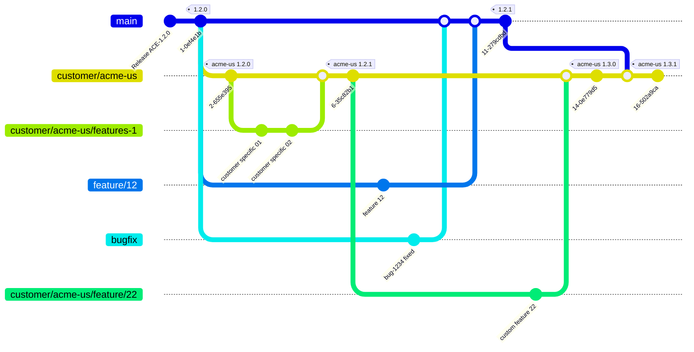

# Customer Branch with New Features and Bugfix Flow

This shows how a software company manages releases for both their main product (ACE) and customer-specific versions, specifically for a customer called "ACME-US."

### Initial Setup

**Starting Point:** The main product ACE version 1.2.0 is released and tagged on the master branch.

### Customer Branch Creation

**Customer Gets Their Own Branch:** A dedicated branch called `customer/acme-us` is created from the main 1.2.0 release. This becomes ACME-US's customized version, initially tagged as "acme-us 1.2.0."

### Customer-Specific Development

**Custom Features for ACME-US:** 
- ACME-US requests specific customizations.
- These features are developed on a dedicated sub-branch (`customer/acme-us/features-1`) for review and isolation.
- The feature branch is merged into the main customer branch, creating version "acme-us 1.2.1".

### Parallel Main Product Development

**Main Product Continues Evolving:**

- While ACME-US gets their customizations, the main product team continues working
- A new feature (feature/12) is developed on a separate feature branch
- A bug (bug-1234) is fixed on a bugfix branch
- Both the feature and bugfix are merged back to master
- This creates main product version 1.2.1

### Customer Requests More Customizations

**Additional Custom Feature:**

- ACME-US requests another custom feature (feature 22)
- This is developed on a sub-branch of their customer branch: `customer/acme-us/feature/22`
- After completion, it's merged into the main ACME-US branch
- This creates "acme-us 1.3.0" (a minor version bump for a significant new custom feature)

### Synchronizing with Main Product

**Getting Latest Main Product Updates:**

- ACME-US wants to benefit from the bug fixes and new features in main 1.2.1
- The main branch (with version 1.2.1) is merged into the ACME-US branch
- This creates "acme-us 1.3.1" - combining their custom features with the latest main product improvements

## Key Benefits of This Process

1. **Isolation:** Customer customizations don't affect the main product
2. **Flexibility:** Customers can get both custom features and main product updates
3. **Version Control:** Clear versioning shows what's included (main features vs. custom features)
4. **Parallel Development:** Main product and customer customizations can be developed simultaneously
5. **Selective Updates:** Customers can choose when to incorporate main product updates

This is a common enterprise software pattern where you maintain a core product while providing customized versions for specific customers with unique requirements.

