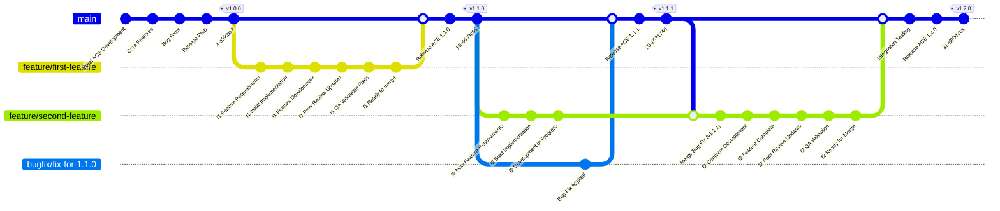

# BugFix During New Feature Development Flow

**First Feature Development (ACE 1.0.0 → 1.1.0):**

- Same as before: feature branch created, developed, reviewed, QA validated, and merged
- Results in ACE version 1.1.0

**Second Feature Development with Bug Fix Scenario:**

1. **New Feature Started:** Second feature branch (`feature/second-feature`) is created from master (v1.1.0)
2. **Parallel Development:** Feature development begins while master remains at v1.1.0

**Bug Fix Interruption:**
3. **Bug Reported:** A bug is discovered in the current master branch
4. **Bug Fix Branch:** A `bugfix` branch is created from `main` to address the issue.
5. **Merge and Release:** The `bugfix` branch is reviewed and merged into `main`, which is then released as ACE v1.1.1 (patch version).

**Feature Branch Synchronization:**
6. **Merge Bug Fix:** The updated `main` branch (containing v1.1.1) is merged into the feature branch.
7. **Continue Development:** Feature development continues with the bug fix included
8. **Complete Process:** Peer review and QA validation are completed

**Final Integration:**
9. **Merge to Master:** Feature branch is merged back to master
10. **New Release:** ACE v1.2.0 is released (minor version increment for new feature)

**Key Points:**

- **Version Numbering:** Bug fix gets patch version (1.1.1), new feature gets minor version (1.2.0)
- **Synchronization:** Feature branch stays current with master by merging the bug fix
- **Quality Maintained:** Same peer review and QA process applies throughout
- **Parallel Work:** Bug fixes don't block feature development, and vice versa

This demonstrates a robust configuration control process that handles both planned features and unplanned bug fixes efficiently.

