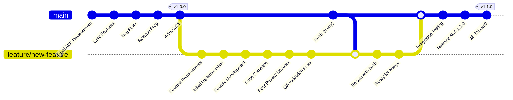

# Simple New Feature Development Flow

## ACE New Feature Development Configuration Control

**Initial Release (ACE 1.0.0):**

- Development starts on the master branch
- Core features, bug fixes, and release preparation are completed
- ACE is released as version 1.0.0

**Feature Development Workflow:**

1. **Feature Request:** A new feature is requested
2. **Branch Creation:** A feature branch (`feature/new-feature`) is created from master
3. **Development Phase:** 
   - Requirements analysis
   - Initial implementation
   - Iterative feature development
   - Code completion

**Quality Assurance Process:**
4. **Peer Review:** Code is reviewed by peers, and updates are made based on feedback
5. **QA Validation:** Quality assurance team validates the feature, and any issues are fixed
6. **Final Preparation:** Feature is marked as ready for merge
7. **Merge HotFixes to the Feature Branch:** Merge fixes reported by QA to the feature brach and keep it aligned with the trunk

**Integration and Release:**

1. **Merge to Master:** The completed and validated feature branch is merged back to master
2. **Integration Testing:** Final integration testing is performed
3. **Release:** ACE 1.1.0 is generated and tagged

**Key Benefits of This Flow:**

- **Isolation:** Feature development doesn't disrupt the stable master branch
- **Quality Gates:** Peer review and QA validation ensure quality before merge
- **Traceability:** Clear version progression from 1.0.0 to 1.1.0
- **Rollback Safety:** Master branch remains stable throughout the process

This is a standard feature branch workflow that ensures proper configuration control and quality assurance for the ACE configuration item.

