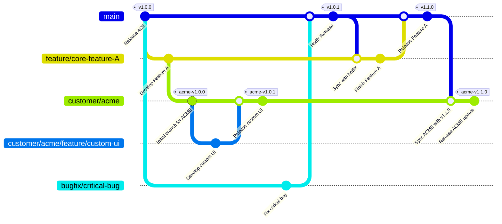

# Unified Software Release Management Process

This document outlines the comprehensive, unified software release and configuration management process for the ACE product line. It combines standard feature development, emergency hotfixes, and the management of customer-specific versions into a single, robust workflow.

## Guiding Principles

1.  **The `main` branch is always stable and deployable.**
2.  **All work is done on a dedicated branch.** No direct commits are ever made to `main` or long-lived `customer` branches. All changes are integrated via pull/merge requests.
3.  **Branches are synchronized regularly.** Feature and customer branches are kept up-to-date with the latest stable code from `main`.
4.  **Semantic Versioning (MAJOR.MINOR.PATCH) is used.**
    *   **PATCH** release for backward-compatible bug fixes (e.g., 1.0.0 -> 1.0.1).
    *   **MINOR** release for new, backward-compatible functionality (e.g., 1.0.1 -> 1.1.0).
    *   **MAJOR** release for incompatible API changes (e.g., 1.1.0 -> 2.0.0).

---

## 1. Core Development Workflow

This covers standard feature development and bug fixes for the main product.

### New Feature Development

1.  **Branch:** Create a `feature/<feature-name>` branch from the latest `main`.
2.  **Develop:** Implement the feature on its branch.
3.  **Review & QA:** Conduct peer reviews and QA validation.
4.  **Merge:** Merge the completed feature branch into `main`.
5.  **Release:** Tag a new **MINOR** version (e.g., `v1.1.0`).

### Bug Fixes (Hotfixes/Patches)

1.  **Branch:** Create a `bugfix/<bug-description>` branch from the latest `main`.
2.  **Develop:** Implement the fix on its branch.
3.  **Review & QA:** Conduct peer reviews and QA validation.
4.  **Merge:** Merge the completed bugfix branch into `main`.
5.  **Release:** Tag a new **PATCH** version (e.g., `v1.1.1`).

---

## 2. Handling Parallel Work (The Hotfix Scenario)

This is a critical process for ensuring stability when a hotfix is required while a feature is in development.

1.  A `feature` branch is in progress.
2.  A critical bug is found in `main`, and a `bugfix` branch is created, fixed, and merged into `main`, resulting in a new patch release (e.g., `v1.1.1`).
3.  **Synchronization (Crucial Step):** The `main` branch (now at `v1.1.1`) **must** be immediately merged into the ongoing `feature` branch.
4.  **Continue:** Development on the feature branch continues, now incorporating the bug fix. This prevents integration conflicts and ensures the new feature is tested against the absolute latest code.

---

## 3. Managing Customer-Specific Releases

This workflow isolates customer customizations from the core product.

### Initial Customer Branch Setup

1.  From a stable `main` release tag (e.g., `v1.2.0`), create a long-lived customer branch: `customer/<customer-name>`.
2.  Tag this initial commit on the customer branch with a customer-specific version, like `acme-us-1.2.0`.

### Developing Custom Features

1.  **Branch:** From the `customer/<customer-name>` branch, create a new sub-branch for the work: `customer/<customer-name>/feature/<feature-name>`.
2.  **Develop & Review:** Develop the custom feature on the sub-branch.
3.  **Merge:** Merge the completed sub-branch back into the main `customer/<customer-name>` branch.
4.  **Tag:** Tag a new customer-specific version (e.g., `acme-us-1.2.1`).

### Synchronizing Customer Branches with Core Product Updates

1.  When the customer is ready to incorporate updates from the core product, merge `main` into the `customer/<customer-name>` branch.
2.  Resolve any merge conflicts, which are often localized to custom code.
3.  Perform thorough regression testing.
4.  Tag a new customer-specific version that reflects the update (e.g., `acme-us-1.3.1`).

---

## Unified Git Flow Diagram

This diagram illustrates all the above processes working in concert.



---

## Example Git Command Workflow

This section provides the specific Git commands that correspond to the unified workflow diagram.

```bash
# Prerequisite: Start on the main branch with an initial release
# git commit -m "Initial commit"
git tag -a v1.0.0 -m "Release ACE v1.0.0"
git push origin main --tags

# --- Scenario: Customer Branch Creation & Custom Feature ---

# 1. Create and check out the customer branch from the v1.0.0 tag
git checkout -b customer/acme v1.0.0
git tag -a acme-v1.0.0 -m "Initial branch for ACME v1.0.0"
git push origin customer/acme --tags

# 2. Develop a customer-specific feature on a sub-branch
git checkout -b customer/acme/feature/custom-ui customer/acme
echo "custom-ui-change" > custom-ui.txt && git add . && git commit -m "feat(acme): Develop custom UI"

# 3. Merge the feature into the customer branch
git checkout customer/acme
git merge --no-ff customer/acme/feature/custom-ui -m "Merge feature 'custom-ui' into customer/acme"
git branch -d customer/acme/feature/custom-ui

# 4. Tag the new customer release
git tag -a acme-v1.0.1 -m "Release custom UI for ACME"
git push origin customer/acme --tags

# --- Scenario: Parallel Core Development (Feature A & Hotfix) ---

# 5. Start development on a new core feature from main
git checkout main
git checkout -b feature/core-feature-A
echo "feature-a-work" > feature-a.txt && git add . && git commit -m "feat: Start development on Feature A"

# 6. A critical bug is found; create a hotfix branch from main
git checkout main
git checkout -b bugfix/critical-bug
echo "critical-fix" > bug.txt && git add . && git commit -m "fix: Fix critical bug"

# 7. Merge the hotfix into main and release a patch
git checkout main
git merge --no-ff bugfix/critical-bug -m "Merge fix for critical bug"
git branch -d bugfix/critical-bug
git tag -a v1.0.1 -m "Hotfix Release v1.0.1"
git push origin main --tags

# 8. Synchronize the in-progress feature branch with the hotfix from main
git checkout feature/core-feature-A
git merge --no-ff main -m "Sync with main (v1.0.1 hotfix)"

# 9. Complete and merge the core feature
echo "finish-feature-a" >> feature-a.txt && git add . && git commit -m "feat: Finish Feature A"
git checkout main
git merge --no-ff feature/core-feature-A -m "Merge feature 'core-feature-A'"
git branch -d feature/core-feature-A
git tag -a v1.1.0 -m "Release Feature A v1.1.0"
git push origin main --tags

# --- Scenario: Syncing the Customer Branch ---

# 10. Update the customer branch with the latest from main
git checkout customer/acme
git merge --no-ff main -m "Sync ACME with main product updates (v1.1.0)"

# 11. Tag the new synchronized customer release
git tag -a acme-v1.1.0 -m "Release ACME update synced with v1.1.0"
git push origin customer/acme --tags
```
